# lab03-grammars
Let's practice using grammars! For this lab, please pull up the L-system node in Houdini.

## 1. Wheat grammar puzzle
Look at these iterations (n = 1, 2, 3) of a one-rule grammar. Using the built in symbols in Houdini, design a grammar that produces this output. Take a screenshot of your rules.\

### Screenshots of iterations and rules 
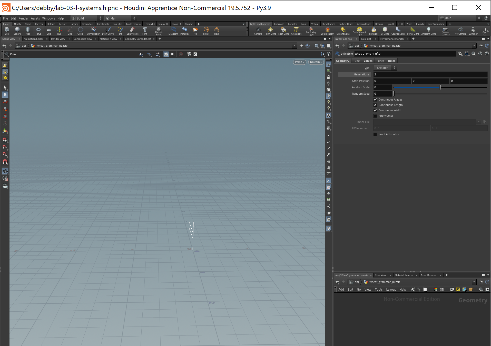
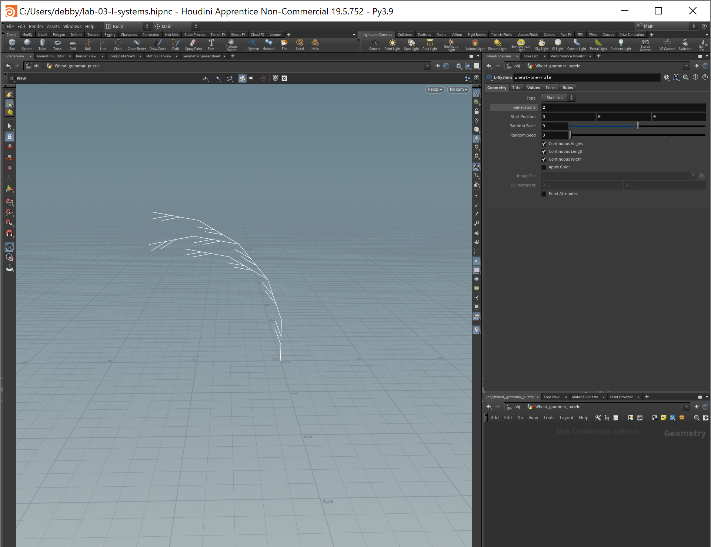
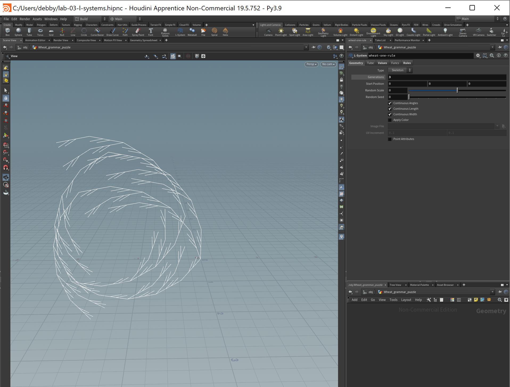
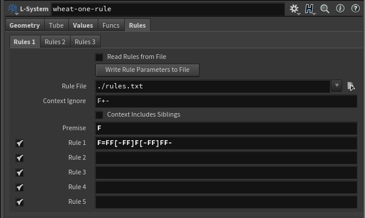

## 2. Square grammar puzzle
How about this one? Take a screenshot of your rules.\

NOTE: adjusted angle to 20

### Screenshots of iterations and rules 
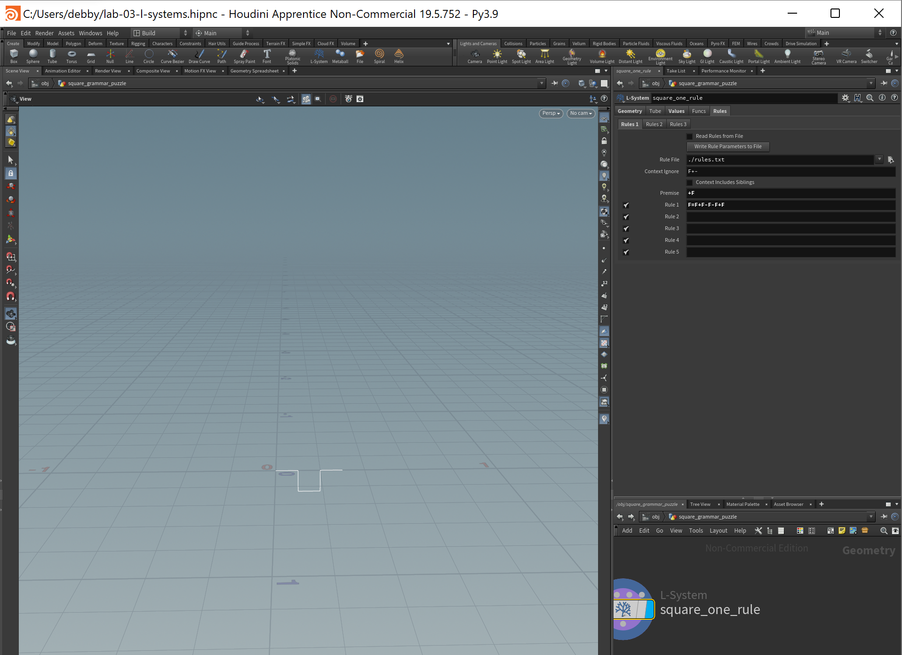
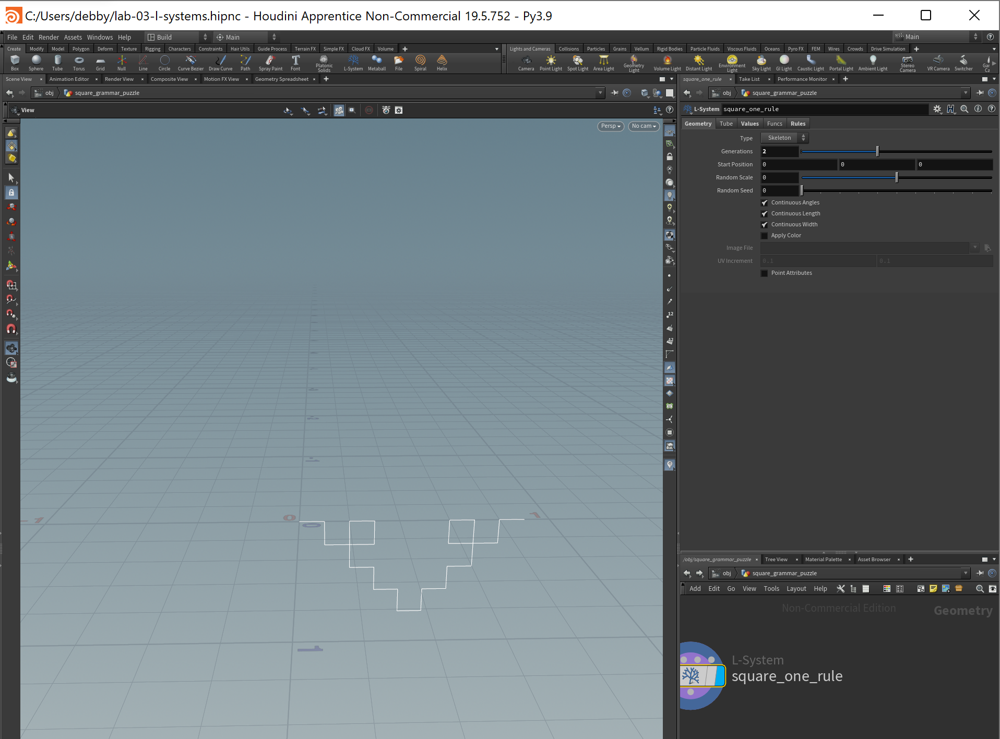
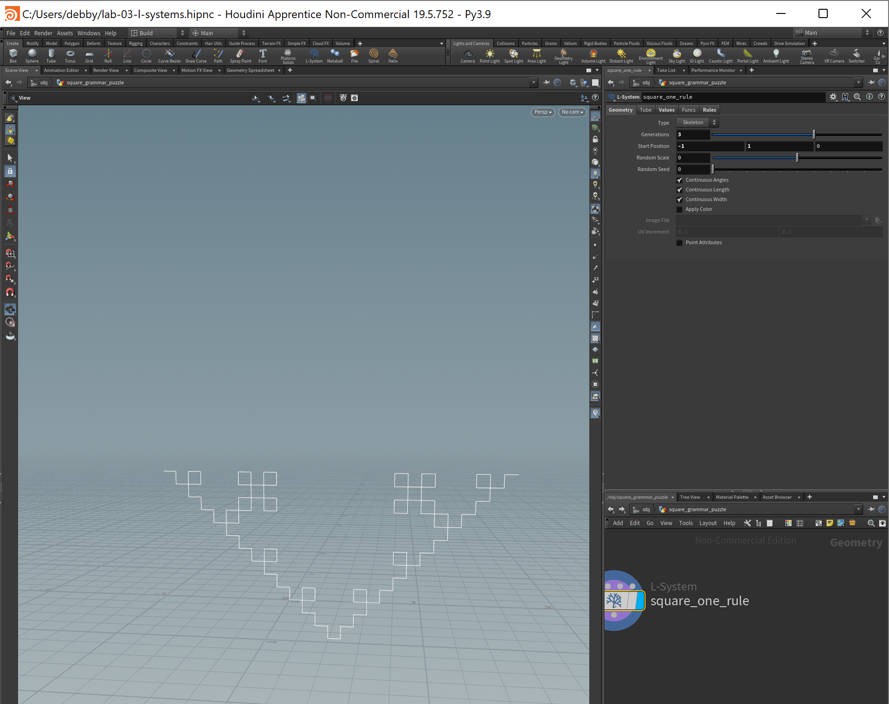
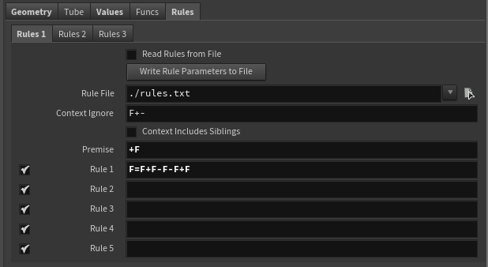

NOTE: adjusted angle to 90  

## 3. Custom plant
Choose a plant in the world. Working off a reference, design a grammar that mimics the structure of that plant. Unlike our simple puzzles, please use multiple rules for greater complexity. Think carefully about the structure of your grammar! EXPLAIN the structure of your plant in the README. What are the components? What do each of the rules do? Be sure to also include images of a few iterations of your output plant. 

### Screenshots of iterations and rules 
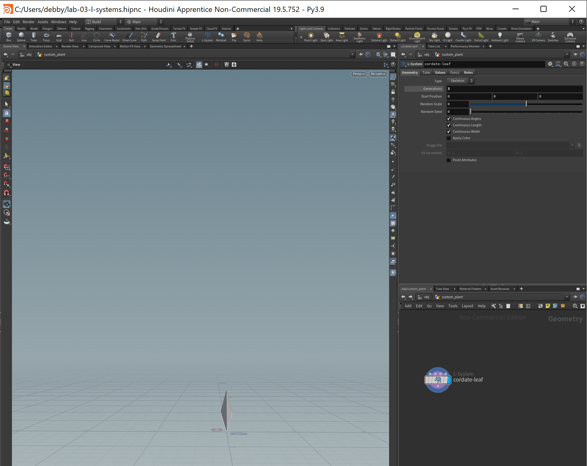
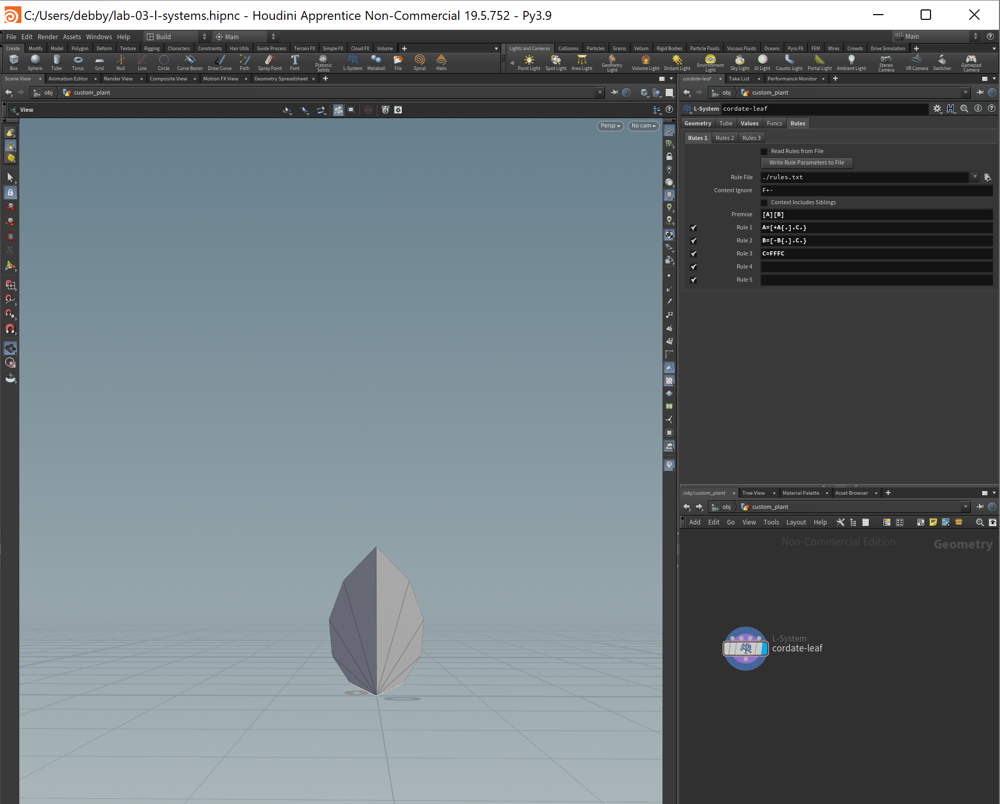
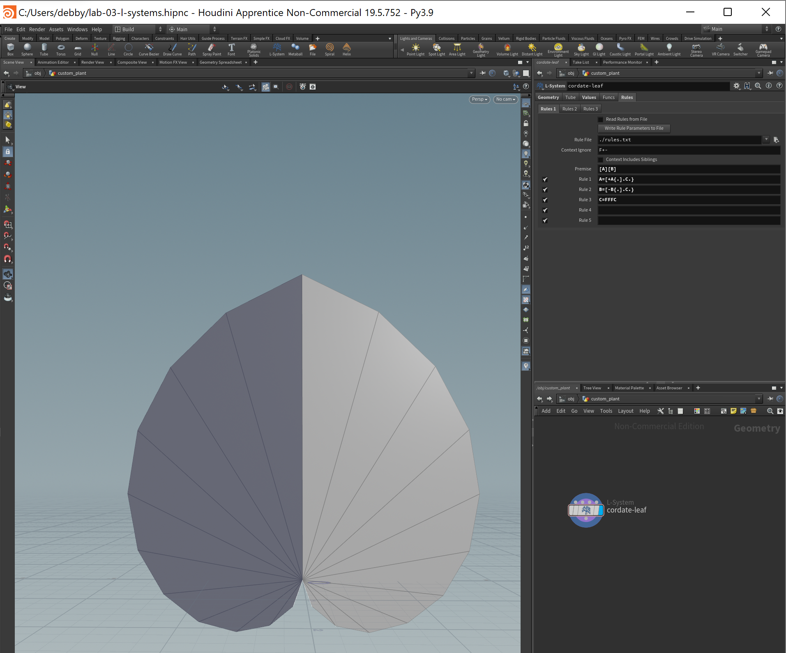
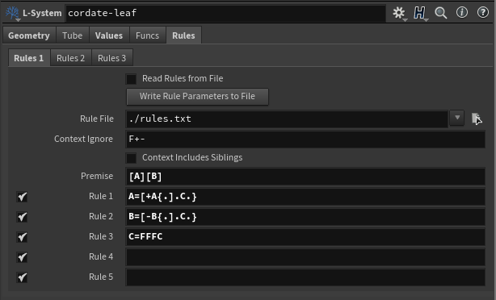

For my custom plant, I chose to replicate a cordate leaf (aka a heart shape leaf). \
I drew polygon surfaces with my L-systems using the following commands: \
{ = Start a polygon \
. = Make a polygon vertex \
} = End a polygon 

My rules were as follows: \
A=[+A{.].C.} \
B=[-B{.].C.} \
C=FFFC 
- A and B are called to rotate/branch off in two different directions (one counterclockwise and the other clockwise) to draw two mirroed sections of the leaf. They are what handle the rotation/branching and drawing of the polygon surfaces. C handles the length of the leaf segment. With the addition of C to A and B, we are able to form longer leaf segments with wider angles with every generation, thereby creating a heart-shape for the leaf instead of just a circular shape. 

## Submission
- Create a pull request against this repository
- In your readme, list your solutions and format your README nicely
- Profit
