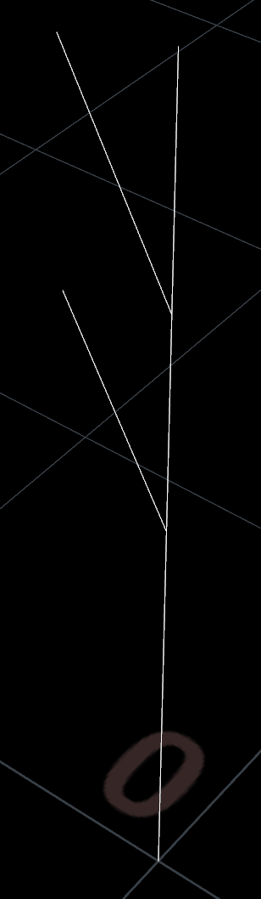
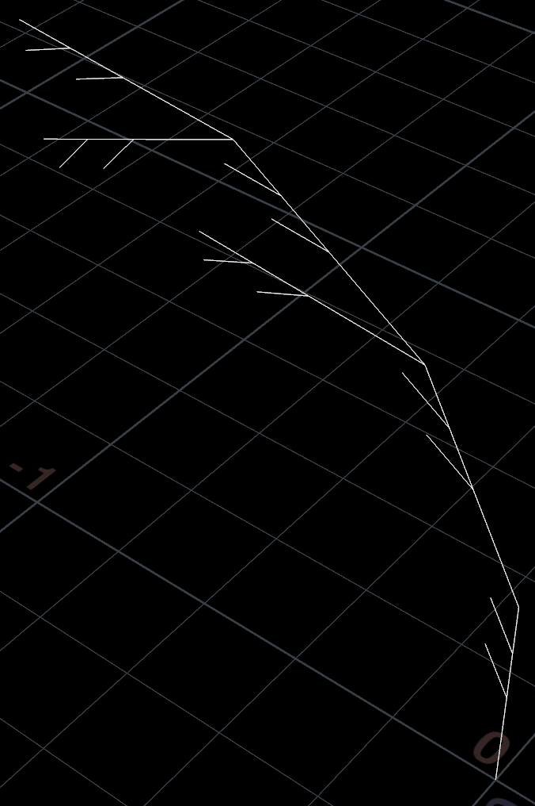
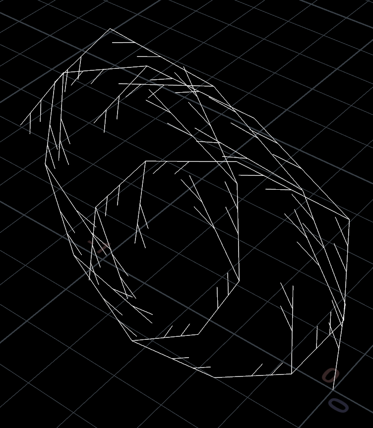
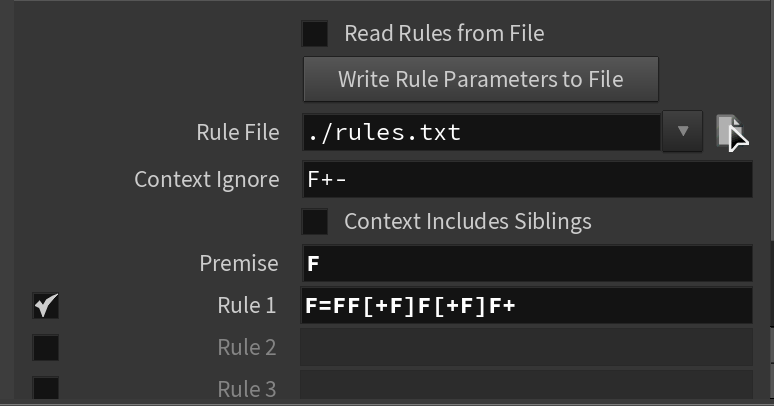
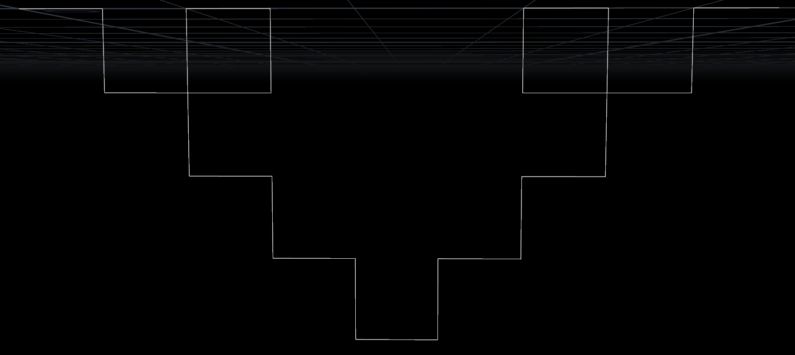
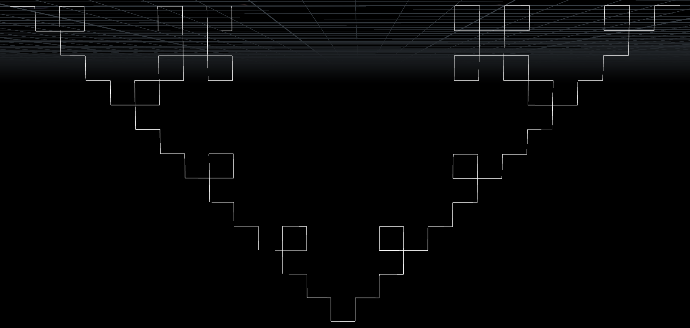
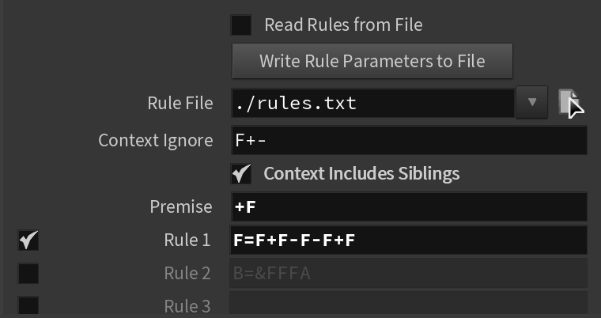
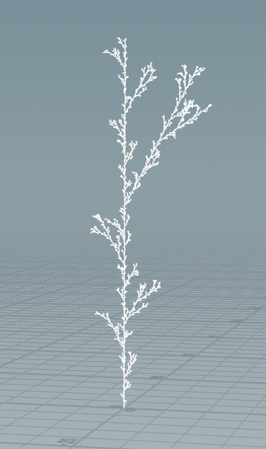
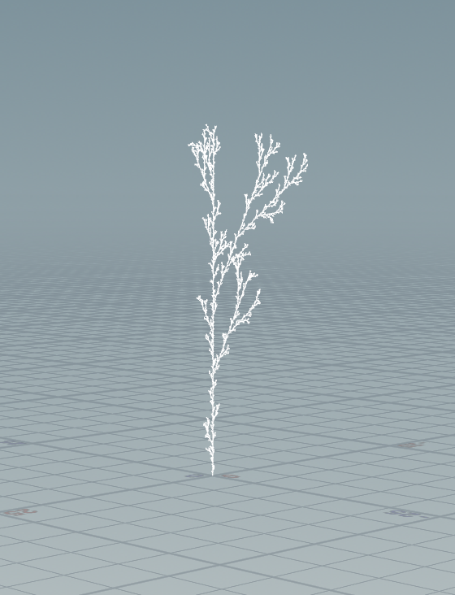

# lab03-grammars - Amy Liu and Nick Liu
## 1. Wheat grammar puzzle
Our Solution:\

Rules:\

## 2. Square grammar puzzle
Our Solution:\

Rules:\

## 3. Custom plant
Our Solution:\
Random Seed 1:\
 \
Random Seed 2:\
 \
Random Seed 3:\
 \
Rules:\
