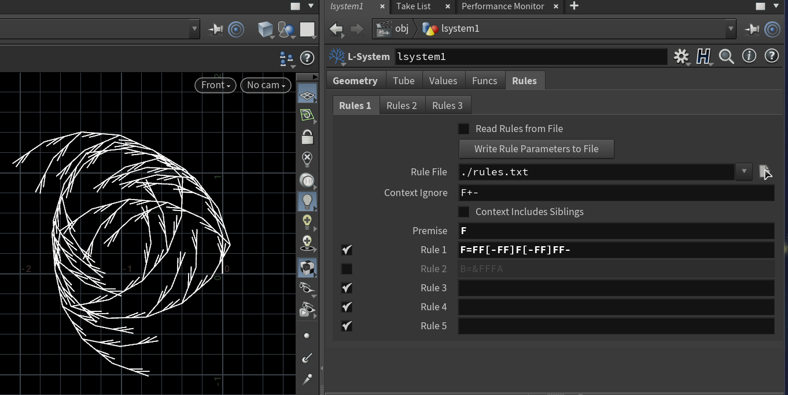
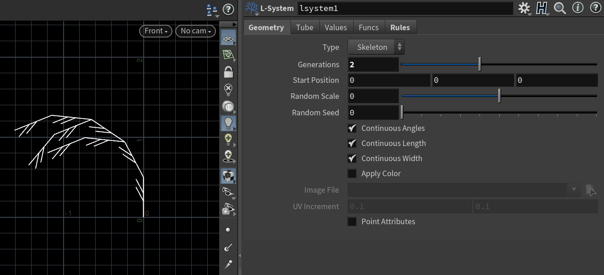
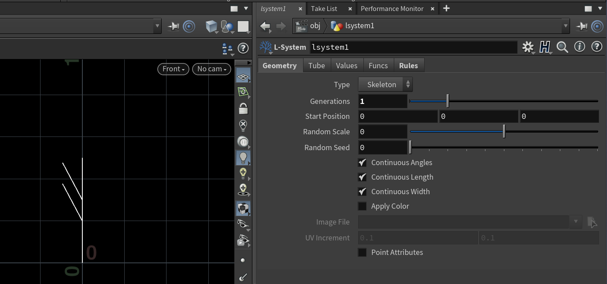
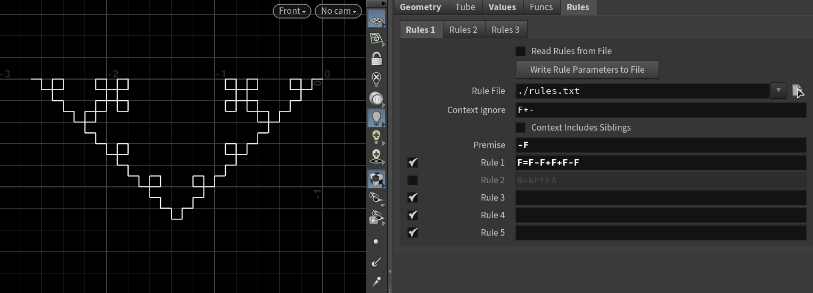
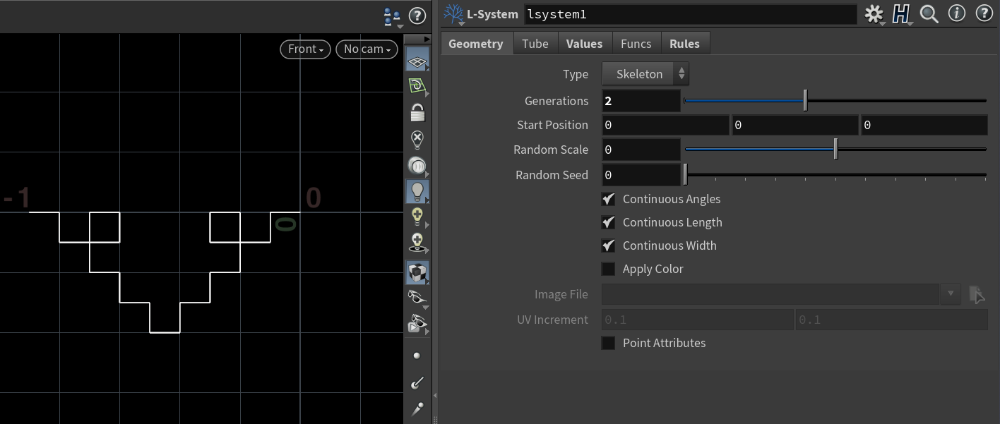
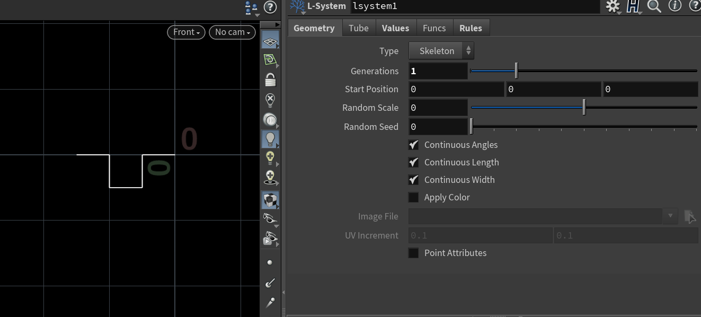
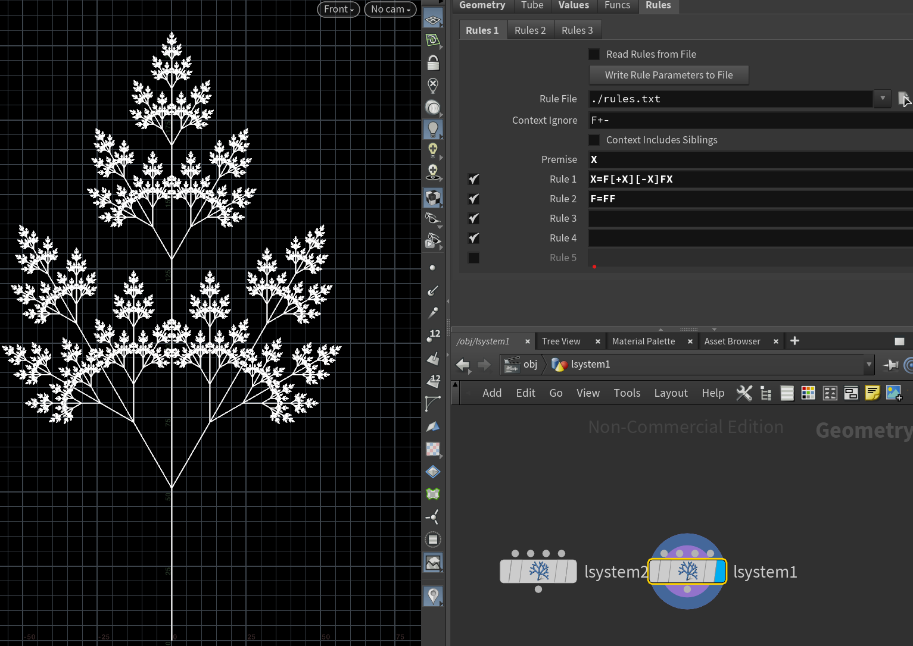
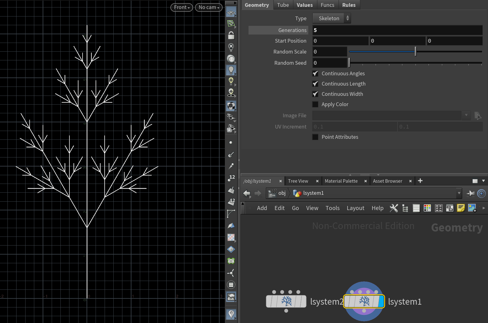
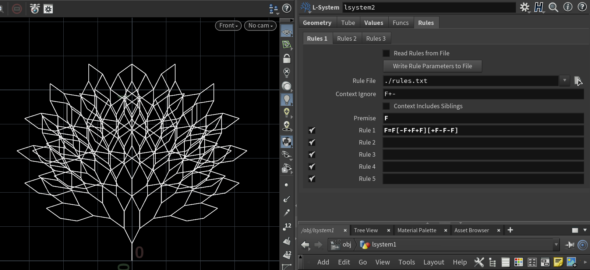
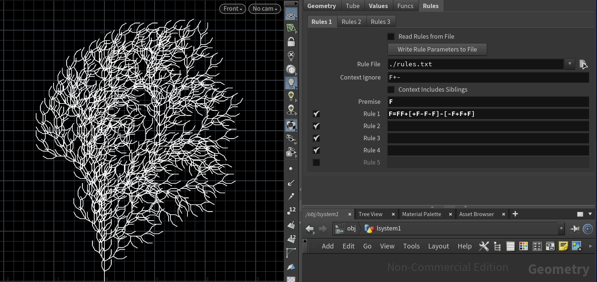

# lab03-grammars
Team members: Keyu and Kehan

## 1. Wheat grammar puzzle

## 2. Square grammar puzzle

## 3. Custom plant
Explanation: We tried to create some symmetric trees like a pine tree. We used multiple rules for this one. The rule F=FF makes the branches longer, and the rule with X creates branches with rotations and allows for a symmetrical branches. We tried a few generations and n=10 and n=5 which look nice are shown below.  

We also experimented with single rule grammar and put here just to show. At n=4 they look nice.

