# L-Systems : Utkarsh Dwivedi & Saksham Nagpal

## 1. Wheat Grammar
```
Premise: F
Rule: F=FF[-FF]F[-FF]FF-
Angle: 20
```

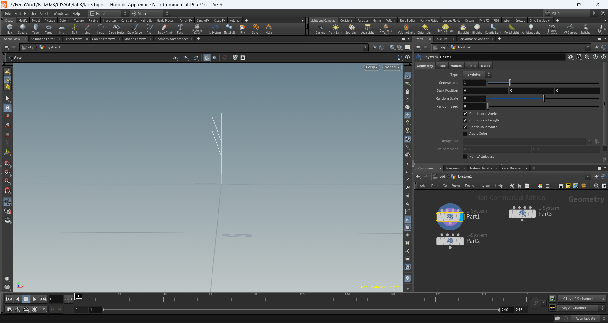

| 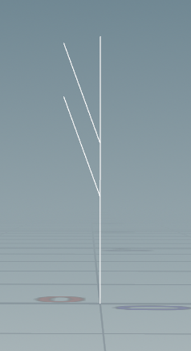 | 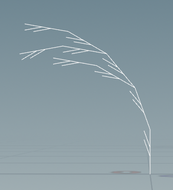 | 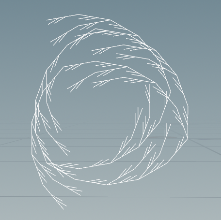 |
|:--:|:--:|:--:|
| *iterations=1* | *iterations=2* | *iterations=3* |

## 2. Square Grammar
```
Premise: +F-
Rule: F=F+F-F-F+F
Angle: 90
```

| 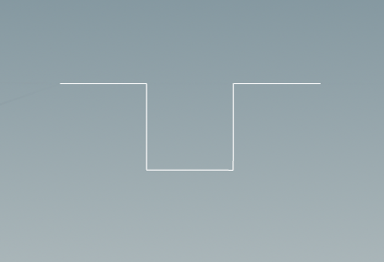 | 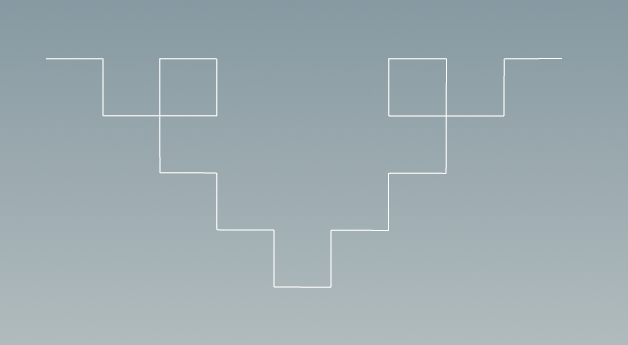 | 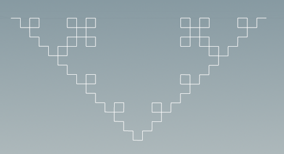 | 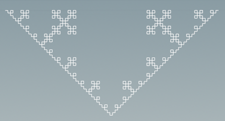 |
|:--:|:--:|:--:|:--:|
| *iterations=1* | *iterations=2* | *iterations=3* | *iterations=4* |

## 3. Custom L-System
We wanted to make a snowflake for our custom L-system, so we tried a bunch of stuff and this is what we finally came up with. This is the grammar that we used:
```
Premise:        D
Rule1:          C=F[--F(.2)C][++F(.2)C]FC[--F(.13)C][++F(.13)C]FC[--FC][++FC]FC
Rule2:          D=[C]+(60)[C]+(60)[C]+(60)[C]+(60)[C]+(60)[C]
```

| 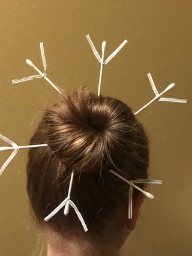 |
|:--:|
| *Reference image (not really)* |

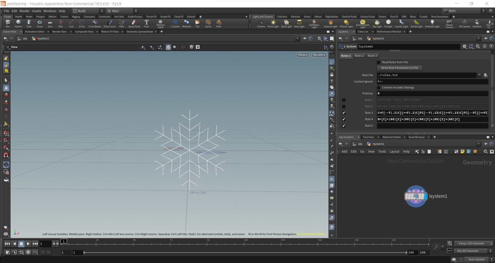


| 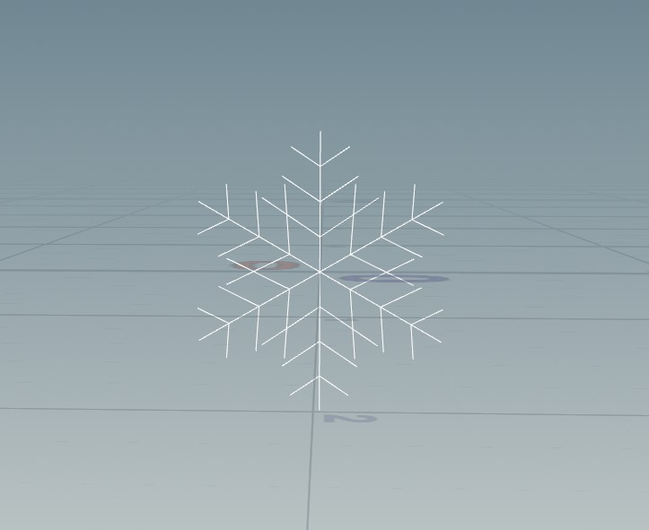 | 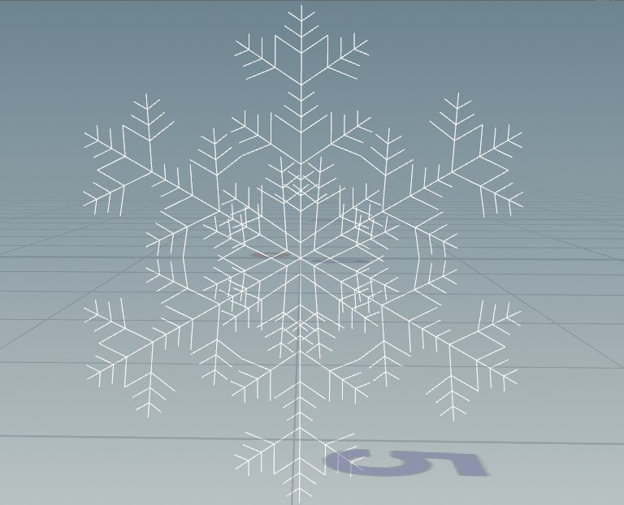 | 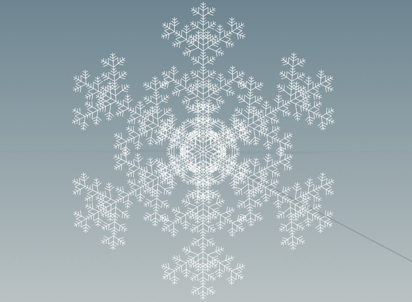 | 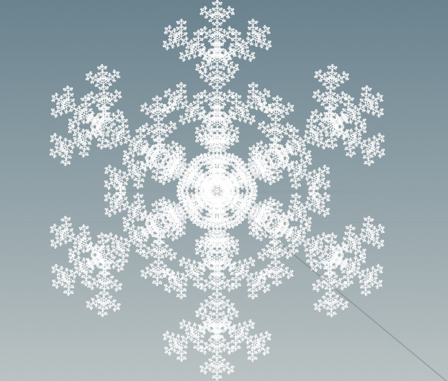 |
|:--:|:--:|:--:|:--:|
| *iterations=1* | *iterations=2* | *iterations=3* | *iterations=4* |

