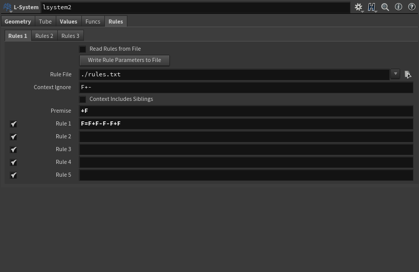
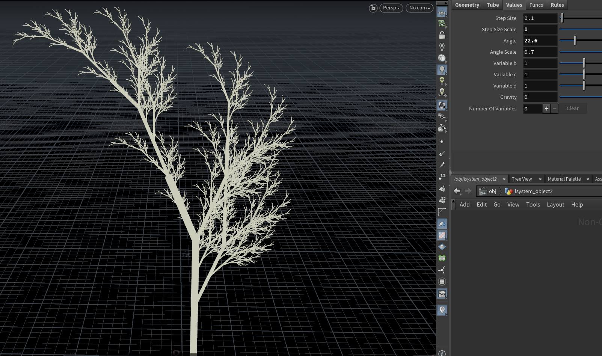
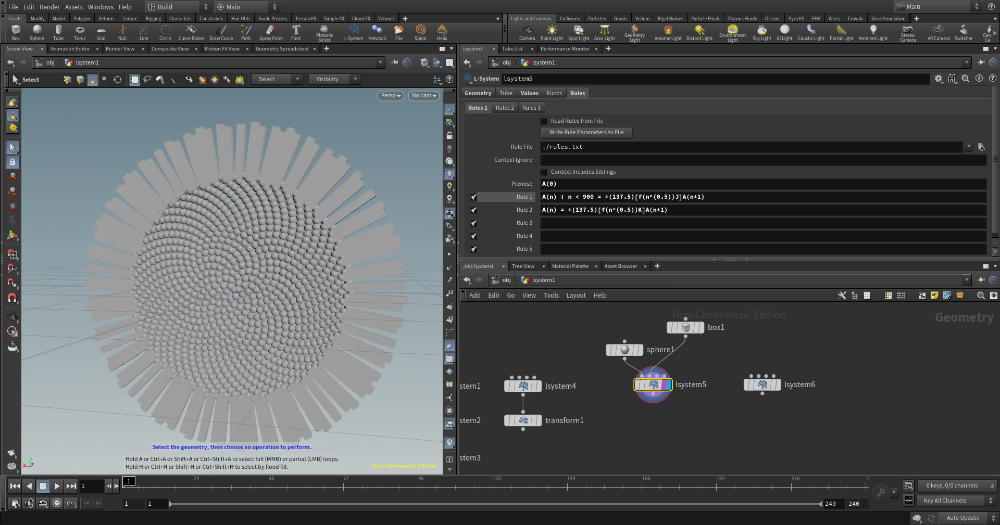

# lab03-grammars
## 0. Group members:

Tongwei Dai

Siyuan Fu

## 1. Wheat grammar puzzle
The grammar we used for this part is
```
F=FF[-FF]F[-FF]FF-
```
where the `[-FF]` is the branch, and the `FF` is the stem, and the `-` at the end makes the recursive part is rotated after each iteration.

The axiom is simply `F`.

### Screenshots:





## 2. Square grammar puzzle
the grammar we used for this part is
```
F=F+F-F-F+F
```
which gives the simple shape show in the first screenshot. The rest are just the result of further recursion. To fix the orientation of the whole structure, we appended a transform node.

The axiom is simply `F`.

### Screenshots:




## 3. Sunflower


We used parametric and conditional production rules to model the head of a sunflower.

```
A(n) : n < 900 = +(137.5)[f(n^(0.5))J]A(n+1)
A(n) = +(137.5)[f(n^(0.5))K]A(n+1)
```

We start with `A(0)`.

Some the magic numbers such as `137.5` and the square root are results of the studies on [Phyllotaxis Pattern](https://en.wikipedia.org/wiki/Phyllotaxis). The formula is derived from the Golden Ratio and has been observed in many natural phenomena.

The intuition behind the production rules is that we always "stay" in the center of the flower head. At each iteration, the turtle turns by `137.5` degrees, then moves forward by the square root of the current iteration number, places an object, and then snaps back to the middle. The process continues until all objects are placed.

Since we will only have `1000` iterations, the conditon `n < 900` makes sure that the turtle places the leaf `J` for the first 900 steps. Otherwise, it will use the leaf `K` which is a sunflower leaf mesh.