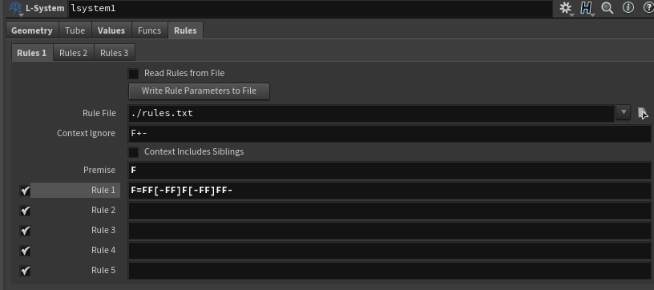
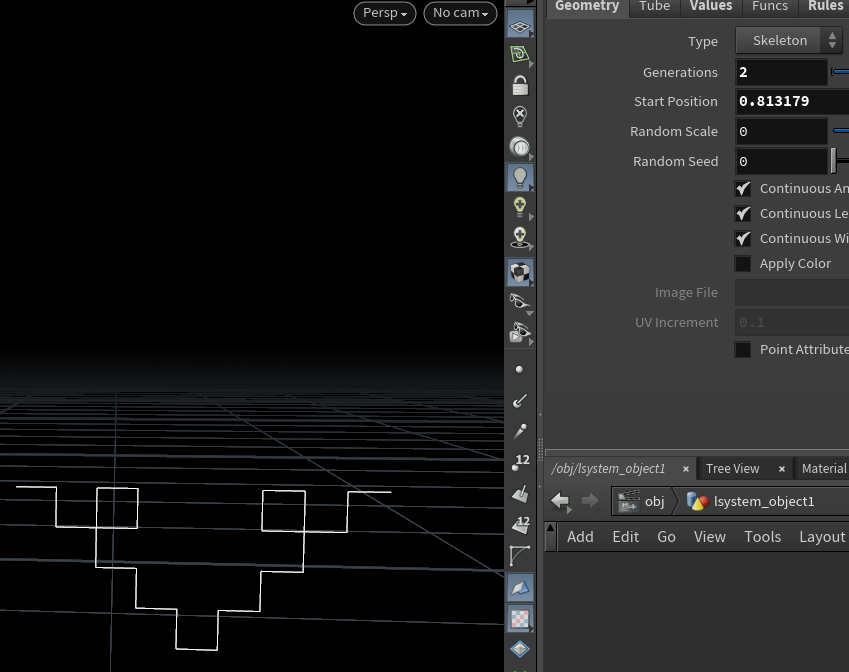
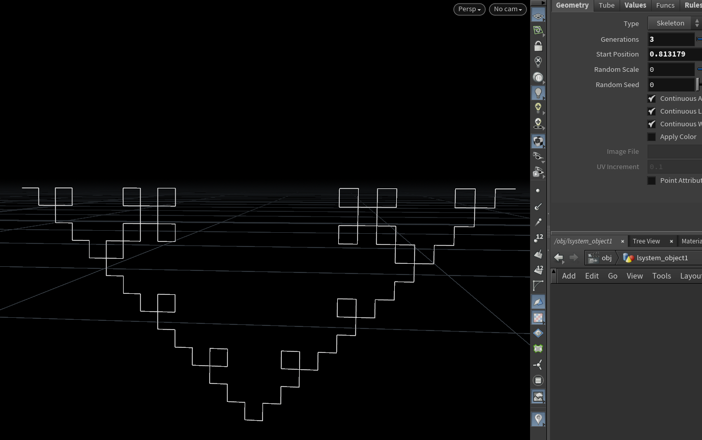

# lab03-grammars

# Result

## 1. Wheat grammar puzzle

### Rule
F=FF[-FF]F[-FF]FF-

**Explain:** 

FF: This means the current line segment extends twice its length. The plant grows straight forward for two units.

[-FF]: This creates a branch. The plant turns left (due to -) and grows forward for two units (FF). Once the growth inside the branch is done (inside the [...]), the plant's state returns to where the branch started.

F: The plant continues growing straight forward for one unit.

[-FF]: Similar to the second step, this creates another branch. The plant again turns left and grows forward for two units.

FF-: The plant grows forward for two units, and then turns left.
## 2. Square grammar puzzle

### Rule
F=F+F-F-F+F

**Explain:**

Move forward one unit (F)

Rotate 90 degrees to the right and move forward one unit (+F)

Rotate 90 degrees to the left and move one unit forward (-F)

Rotate 90 degrees to the left and move one unit forward (-F)

Rotate 90 degrees to the right and move forward one unit (+F)
## 3. Custom plant
**Fern Structure:**

A fern's structure can be broken down into a few key components:

Stem: The central part that provides support.
Fronds: The large divided leaves. These are the main visual components of the fern and they branch out from the stem. Each frond can have smaller sub-fronds, displaying a recursive pattern.

### Role
X

X -> F+[[X]-X]-F[-FX]+X

F -> FF

**Explain:** 

Rule X: This rule mimics the growth of the fern. It starts by drawing the stem (F), then branching out ([...]) to create fronds and sub-fronds. The plus (+) and minus (-) symbols give it a twist and turn, capturing the natural randomness of ferns. Recursive usage of X in this rule ensures the fractal nature of ferns where each frond can have its own sub-fronds.

Rule F: This is a simple rule where every stem segment is elongated, simulating the growth of the stem.
