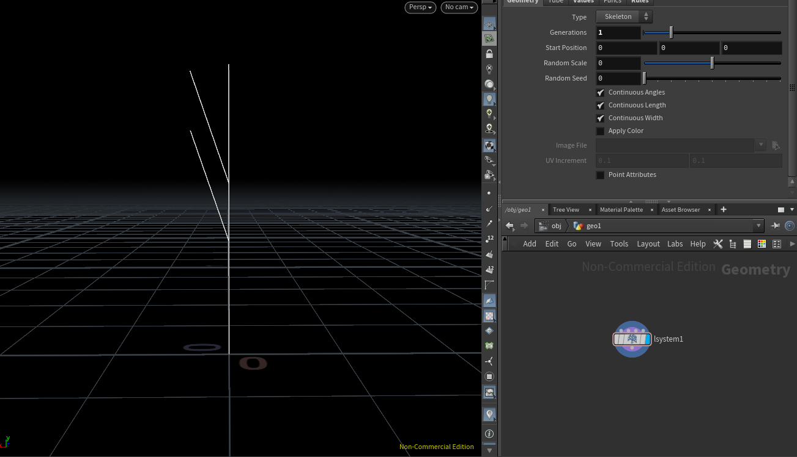
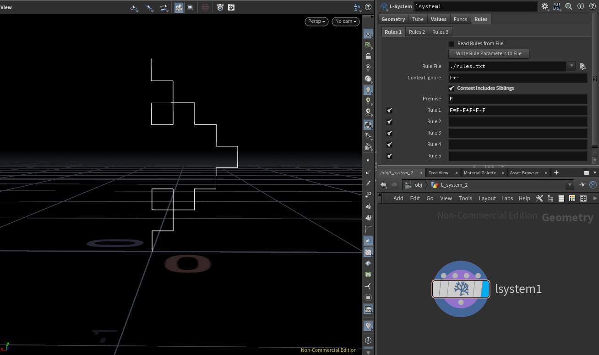

# lab03-grammars
Let's practice using grammars! For this lab, please pull up the L-system node in Houdini.

## 1. Wheat grammar puzzle
Look at these iterations (n = 1, 2, 3) of a one-rule grammar. Using the built in symbols in Houdini, design a grammar that produces this output. Take a screenshot of your rules.\


## 2. Square grammar puzzle
How about this one? Take a screenshot of your rules.\


## 3. Custom plant
Choose a plant in the world. Working off a reference, design a grammar that mimics the structure of that plant. Unlike our simple puzzles, please use multiple rules for greater complexity. Think carefully about the structure of your grammar! EXPLAIN the structure of your plant in the README. What are the components? What do each of the rules do? Be sure to also include images of a few iterations of your output plant. 

## Submission
- Create a pull request against this repository
- In your readme, list your solutions and format your README nicely
- Profit
l

# **Jackie Li and Rachel Lin Lab 03 Submission**

## **Lab Submissions and detailed breakdown.**

### **Wheat Grammar Puzzle**
Rule for Wheat Grammar Puzzle:
```
F=FF[+FF]F[+FF]FF+
```

Iterations = 1 photo:


Iterations = 2 photo:


Iterations = 3 photo:


It took a while for us to figure out the basics of writing the L-System, but when we figured out how to only use one variable (the forward terminal) to write the basic Generation 1 L-System, we quickly figured out the pattern to get the correct Generation 1 L-System. There was a hint given to us by the TA to add an extra rotation after our last forward in order to obtain the final twist for Generation 3.

### **Square Grammar Puzzle**
Rule for Square Grammar Puzzle:
```
F=F-F+F+F-F
```

Iterations = 1 photo:


Iterations = 2 photo:


Iterations = 3 photo:


The hardest portion for implementing this rule was figuring out how to get our entire shape in the correct rotation at all Generations. When we first implemented this system, our shape was rotating a certain degree every Generation, due to the way that we placed a rotation symbol before the very first branch. We then figured that we have to place the F at the first slot such that the geometry will always stay at the same rotation no matter what Generation it is at, but now it is rotated at a 90 degree angle off from the original.

### **Custom Plants and Other Miscellaneous Experiments**

_This section is reserved for three various rules that I used for a custom plant. My partner Rachel and I were attempting to create a fern using L-System rules; however, our creations ended up drastically different, and hence we have different custom plant submissions for this lab. After some experimentation, I have two of my unique fern attempts/implementations, and the third submission I used a reference from the L-System implementation of a Barnsley fern, which I found out was a popular subject of L-Systems in the graphics world._

This plant is a plant that I do not know the name of, but have definitely seen before out in the world.

Rule for custom plant 1:
```
F=FFF[+FFF][-FFF][+FF]\\[+FFFFF][-F-F]\\&FFF[+FFF][-FFF][+FF][-F-F]
```


For the first fern, I forgot to save the rule that I used, but here is the screenshot that I took of it in Houdini:


This fern holds the rule for the Barnsley Fern. I had to spend some time wrapping my head around the concept of using a holder variable for writing the fern's implementation. It is my belief that the wrapper variable X that you will be seeing in the rule is updated every iteration with the value of the previous x, and the second rule F = FF is only increasing the size of the original F. 

Rule for Barnsley Fern: 
```
X=F-[[X]+X]+F[+FX]-X
F=FF
```


***This section is to be continued in potential future updates as I continue to experiment with L-Systems.***