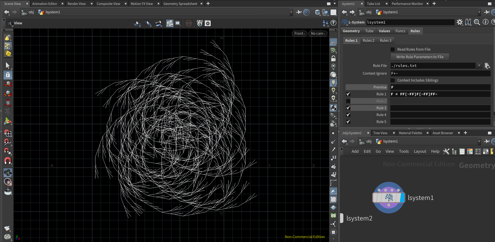
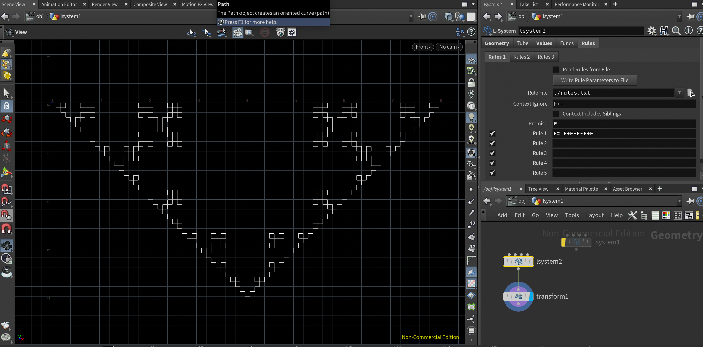
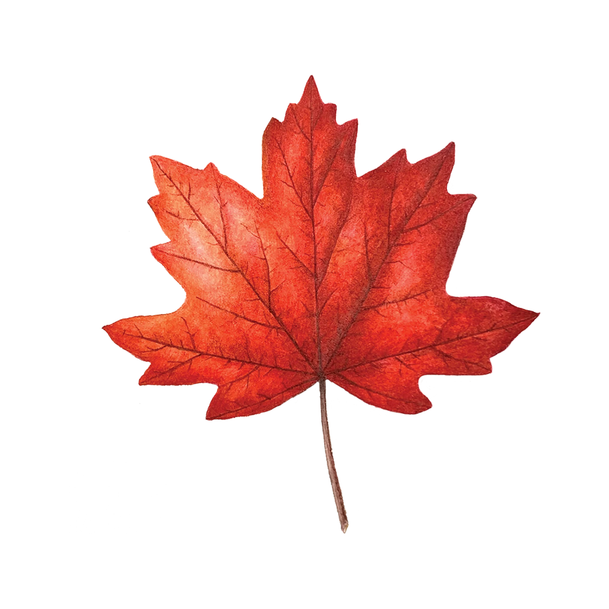
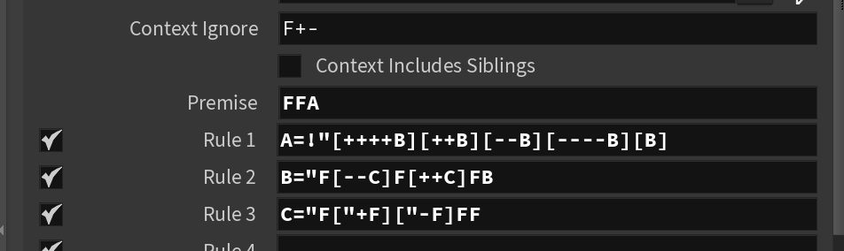
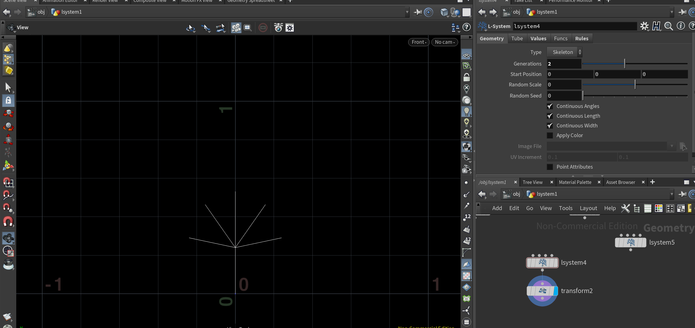
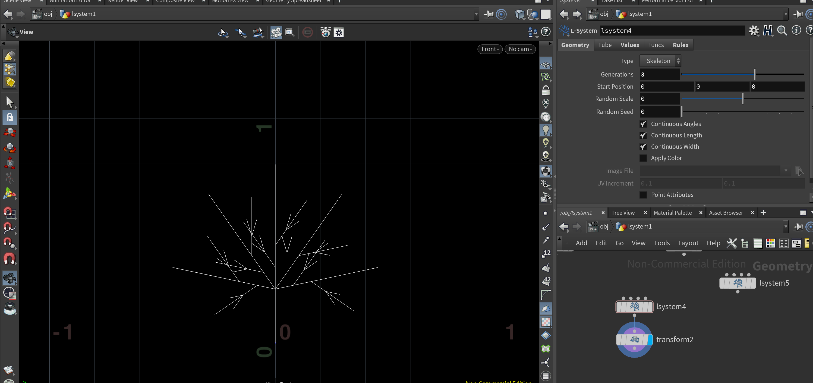

# lab03-grammars
by Sherry Li

## 1. Wheat Grammar
Iteration 4 and the rules can be seen below.

## 2. Square Grammar
Iteration 4 and the rules can be seen below.

## 3. Custom Plant
I chose to emulate the veins of a maple leaf! From looking at references, the general construction I observed was five primary veins that branched off in an alternating left and right pattern. These sub-veins would then branch off again in a similar pattern.

My rules and iterations 1-5 can be seen below.

Let's practice using grammars! For this lab, please pull up the L-system node in Houdini.

## 1. Wheat grammar puzzle
Look at these iterations (n = 1, 2, 3) of a one-rule grammar. Using the built in symbols in Houdini, design a grammar that produces this output. Take a screenshot of your rules.\

## 2. Square grammar puzzle
How about this one? Take a screenshot of your rules.\

## 3. Custom plant
Choose a plant in the world. Working off a reference, design a grammar that mimics the structure of that plant. Unlike our simple puzzles, please use multiple rules for greater complexity. Think carefully about the structure of your grammar! EXPLAIN the structure of your plant in the README. What are the components? What do each of the rules do? Be sure to also include images of a few iterations of your output plant. 

## Submission
- Create a pull request against this repository
- In your readme, list your solutions and format your README nicely
- Profit
